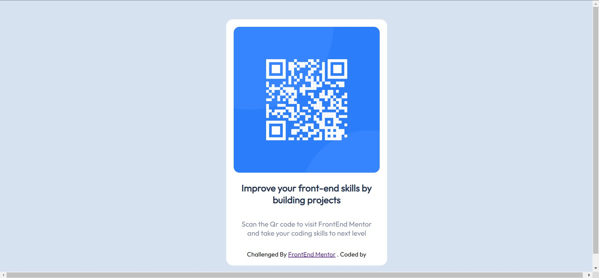

# QR-CodeComponent-Challenge
This is a solution to the [QR code component challenge on Frontend Mentor](https://www.frontendmentor.io/challenges/qr-code-component-iux_sIO_H). Frontend Mentor challenges help you improve your coding skills by building realistic projects. 

[Overview](#overview)
  - [Screenshot](#screenshot)
  - [Mobile View](#mobile-view)
  - [Links](#links)
- [My process](#my-process)
  - [Built with](#built-with)
  - [What I learned](#what-i-learned)
  - [Continued development](#continued-development)
  - [Useful resources](#useful-resources)
- [Author](#author)
- [Acknowledgments](#acknowledgments)

## Overview

### Screenshot

### Mobile VIew

### Links

- Solution URL: [https://github.com/aditya-narayan-sahoo/QR-CodeComponent-Challenge](https://github.com/aditya-narayan-sahoo/QR-CodeComponent-Challenge)
- Live Site URL: [https://aditya-narayan-sahoo.github.io/QR-CodeComponent-Challenge/](https://aditya-narayan-sahoo.github.io/QR-CodeComponent-Challenge/)

## My process

### Built with

- Semantic HTML5 markup
- CSS custom properties
- Flexbox
- Mobile-first workflow

### What I learned

The major learning in this project was the use of flebox and its properties. 

### Continued development

Use this section to outline areas that you want to continue focusing on in future projects. These could be concepts you're still not completely comfortable with or techniques you found useful that you want to refine and perfect.

### Useful resources

- [MDN Web Docs](https://developer.mozilla.org/en-US/docs/Learn/CSS/CSS_layout/Flexbox) - This helped me to understand flexbox properties. I really liked this pattern and will use it going forward.

## Author

- Website - [Aditya Narayan Sahoo](https://github.com/aditya-narayan-sahoo)

## Acknowledgments

The MDN Web Docs has become the one site solutions for all my problems. You can too try it out at [MDN Web Docs](https://developer.mozilla.org/en-US/)

